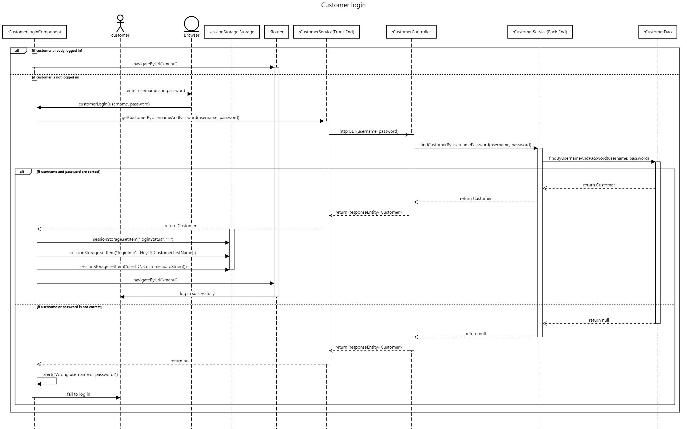
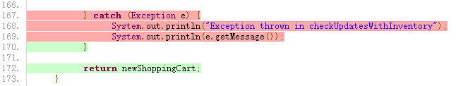

# PROJECT Design Documentation

> _The following template provides the headings for your Design
> Documentation.  As you edit each section make sure you remove these
> commentary 'blockquotes'; the lines that start with a > character
> and appear in the generated PDF in italics._

## Team Information
* Team name: Team 3
* Team members
  * Aayush Panchal
  * Sumit Mahto
  * Prathamesh Mahendra Patwekar
  * Jiangnan Xu
  * Huadong Zhang

## Executive Summary

 

### Purpose
> _Provide a very brief statement about the project and the most
> important user group and user goals._

Team 3 aims to design and implement a web application which provide online food ordering service. 
User groups of the web are: 

a) Customers, who operate on our web for the task of food item ordering; Their main goal is to order food items successfully, a series of goals fall under this umbrella, namely: 

1. browse food items; 
2. search for specific food items; 
3. view details of food items; 
4. add food items to cart;
5. manage the cart; 
6. customize dish and add it to cart;
7. track history orders;
8. sign up/in/out;
9. check out.
10. create Orders.

b) Admins, who operate on our web for the task of food item managing; Their main goal is to manage food items, a series of goals fall under this umbrella, namely: 
1. browse food items; 
2. search for specific food items;
3. add/ delete food items;
4. edit details of food items;
5. sign in/out.

### Glossary and Acronyms
> _Provide a table of terms and acronyms._

| Term | Definition |
|------|------------|
| SPA | Single Page |

## Requirements

This section describes the features of the application.

> _In this section you do not need to be exhaustive and list every
> story.  Focus on top-level features from the Vision document and
> maybe Epics and critical Stories._

### Definition of MVP
> _Provide a simple description of the Minimum Viable Product._

Admin can create a new dish in the inventory (price and quantity).  
Admin can delete a dish in the inventory.  
Admin or Customer can retrieve a specific dish.  
Admin or Customer can search for a dish by partial name.  
Admin can update the price or quantity of a dish in the inventory.  
Admin or Customer can get the list of all the dishes (name, price, quantity, etc.) in the inventory.  
Customer can add/update/remove dishes from the shopping cart.  
Customer can create a new order and Track his order history.  

### MVP Features
> _Provide a list of top-level Epics and/or Stories of the MVP._

Epic: Login, Logout and Registeration
* Customer Registration
  * As a customer I want to register my account with a username, a password, a first name, a last name, an email, a phone number, and an address so that I can use the system.
* Customer Login/Logout
  * As a customer I want to use my username and password to log in to/log out of the system so that I can browse and order food.
* Admin Login/Logout
  * As an admin I want to use my username and password to log in to/log out of the system so that I can manage the inventory.
 
Epic: Inventory Management
* Add Dishes into Inventory
  * As an admin I want to add the dishes to the inventory so that the customer can see and order the added dishes.
* Remove Dishes from Inventory
  * As an admin I want to remove the dishes from the inventory so that the customer can not see and order the unavailable dishes.
* Edit Dishes in Inventory
  * As an admin I want to edit the dishes in the inventory so that the customer can see the updated information of the dishes.
 
Epic: Customer Functionality
* Browse the Menu
  * As a customer I want to be able to view a list of dishes on the menu so that I can choose to add a dish to my shopping cart 
* Customer Food Search
  * As a customer I want to be able to search for a food dish by its partial name on the menu so that I can find it easily.
* Adding to the Cart
  * As a customer, I want to be able to add a dish from the menu to the shopping cart so that it can be a part of my final order.

* Removing Dish from the Cart
  * As a customer, I want to be able to remove a dish that is already in the shopping cart so that it will not be a part of my final order.
* Order Creation
  * As a customer, I want to be able to checkout and create an order containing the items in the shopping cart.
* Tracking Orders
  * As a customer, I want to be able to track history orders.
* Customizing a dish (10% feature)
  * As a customer, I want to be able customize and create my own dish with some base ingredients and order the customized dish.
 
### Roadmap of Enhancements
> _Provide a list of top-level features in the order you plan to consider them._

Dish Customization:
As a customer I want to customize the ingredients of my dishes so that I can have the flavor I like for the dishes I order.

## Application Domain

This section describes the application domain.

> _Provide a high-level overview of the domain for this application. You
> can discuss the more important domain entities and their relationship
> to each other._

Each user (Customer or Admin) owns their username and password. Additionally, Customers have their personal information, including first name, last name, email, phone, and address. Customers can browse/search/view Food Dishes or customize Food Dishes, and add/remove/edit these Food Dishes in Shopping Cart. Admins can manage Food Dishes in the Inventory. Each Food Dish has its own information, including name, cost, quantity, recipe, description, and image.

## Architecture and Design

This section describes the application architecture.

### Summary

The following Tiers/Layers model shows a high-level view of the webapp's architecture.

The e-store web application, is built using the Model–View–ViewModel (MVVM) architecture pattern. 

The Model stores the application data objects including any functionality to provide persistance. 

The View is the client-side SPA built with Angular utilizing HTML, CSS and TypeScript. The ViewModel provides RESTful APIs to the client (View) as well as any logic required to manipulate the data objects from the Model.

Both the ViewModel and Model are built using Java and Spring Framework. Details of the components within these tiers are supplied below.

### Overview of User Interface

This section describes the web interface flow; this is how the user views and interacts
with the e-store application.

> _Provide a summary of the application's user interface.  Describe, from
> the user's perspective, the flow of the pages in the web application._

The user will be first navigated to the menu page which includes a list of food dishes. The user can click on the dish to go to the detail page.

On the detail page, the user can view all the information about the dish. If the user is already logged in as a customer, the customer will be able to add the dish to the shopping cart.

Also, on the menu page, the user can click a button to go to the customize dish page. On the customize dish page, the user can select topping and rice from two droplists. If the user is already logged in as a customer, the customer will be able to add the customized dish to the shopping cart.

If the user is already logged in as a customer, the user can see a hovering shopping cart in the menu and detail page. Also, the customer can go to a separate shopping cart page to modify the quantity of dishes in the shopping cart.

The customer can log in through the login page with the username and password. If the customer doesn't have an account, the user can register one through the registration page. The customer also can modify their profile on the profile page.

The admin can log in through a separate admin log-in page. The admin can update/remove the dish in the inventory and add new dishes.

### View Tier
> _Provide a summary of the View Tier UI of your architecture.
> Describe the types of components in the tier and describe their
> responsibilities.  This should be a narrative description, i.e. it has
> a flow or "story line" that the reader can follow._

> _You must also provide sequence diagrams as is relevant to a particular aspects 
> of the design that you are describing.  For example, in e-store you might create a 
> sequence diagram of a customer searching for an item and adding to their cart. 
> Be sure to include an relevant HTTP reuqests from the client-side to the server-side 
> to help illustrate the end-to-end flow._

We use 17 components/classes for the UI of the web pages. Based on their responsibilities, we categorize them into three categories: Admin-related components, Customer-related components, and Navigation-related components. This section describes their responsibilities and relationships.

Admin-related components:
* admin-login
  * Provide the login page for the admin. 
* inventory
  * Provide the page that includes the list of dishes in the inventory for the admin. The page also provides a search function.
* inventory-add-dish
  * Provide the page that allows the admin to add a new dish to the inventory.
* inventory-dish-detail
  * Provide the page that allows the admin to update or remove the dish in the inventory.

Customer-related components:
* customer-registration
  * Provide the registration page for the customer. The customer can get a new account on this page.
* customer-login
  * Provide the login page for the customer. 

* customer-profile
  * Provide the page that allows the customer to modify their profile.
* menu
  * Provide the page that includes the list of dishes in the inventory for the customer. The page also provides a search function.
* menu-dish-detail
  * Provide the page that allows the customer to view the detail of the dish and add the dish to the shopping cart. 

* shopping-cart
  * Provide the page that allows the customer to modify the quantities of dishes in the shopping cart.
* shopping-cart-hovering
  * Provide a hovering window that includes the overview of the current dish in the shopping cart in the menu and menu-dish-detail pages.
* customize-dish
  * Provide the page that allows the customer to customize dish.
* order-overview
  * Provide the page that allows the customer to view all the history orders.
* order-detail
  * Provide the page that allows the customer to view the detail of an order.

Navigation-related components:
* login-and-user-status
  * Indicate the login status of the user. If the user doesn't log in, the user will see "Please log in". Otherwise, the user will see "Hey! username".
* logo-mid
  * Show the logo of the e-store. The customer/admin can also go back to the menu/inventory page by clicking the logo.
* right-icons
  * Based on the user status, provide the icons that navigate users to different pages, such as customer-profile, shopping-cart, etc.

This figure described the relationships between components. The blue components are for the navigation bar and their functions will vary based on the user status. The yellow and green components are for the customers. However, if the admin doesn't log in, the admin can also use the green components. The red components are for the administrators. The lines between components represent the basic navigations between components.

### ViewModel Tier
> _Provide a summary of this tier of your architecture. This
> section will follow the same instructions that are given for the View
> Tier above._

> _At appropriate places as part of this narrative provide one or more
> static models (UML class diagrams) with some details such as critical attributes and methods._

As described in the last section, we have 17 components/classes for displaying the front-end web pages. Additionally, we have 5 service classes (AdminService, CustomerService, FoodDishService, OrderService, ShoppingCartService) for front-end to back-end communication, 5 corresponding interfaces (Admin, Customer, FoodDish, Order, ShoopingCartItemDataFormat) for the request body, and 1 service class (WebMessageService) for between-component data communication.

This UML class diagram includes all the classes and interfaces including the native angular classes such as AppModule.

For better readability, the following detailed class diagrams only include the webpage components and services (except for the WebMessageService).

Class diagram for admin and customer authentication&account:

Class diagram for inventory, menu, customized dish, shopping cart, and order:

Class diagram for navigation-related components:

### Model Tier 
> _Provide a summary of this tier of your architecture. This
> section will follow the same instructions that are given for the View
> Tier above._

> _At appropriate places as part of this narrative provide one or more
> static models (UML class diagrams) with some details such as critical attributes and methods._

The model tier consists of all components needed for the backend to function as desired. Following are the components and their brief descriptions:
* Order
   * This components is used to represent an order placed by the customer in the past. 
* FoodDish
   * FoodDish is one of the central components around which the backend is built. It represents a food dish that may be available in the inventory or as a                                                                customized dish. It holds the name of the dish, it's cost, quantity, recipe, description and a link to the representative image of the dish.
* Customer
   * Customer component represents the end user for whom the application is intended for. The component holds a customer's name, username, password, email                  and phone number.
* Admin
   * The Admin component is seperate from the Customer component. It stores similar information, however, the Admin has administrative privilages and access that the customer does not have.
* ShoppingCart
   * The ShoppingCart component holds the data for a Customer's shopping cart. It contains the total number of food dishes and a list of food dishes along with their corresponding quantity.
* ShoppingCartItemDataFormat 
   * is a component that is used to help persist ShoppingCartData. The persisted data follows the format that ShoppingCartItemDataFormat follows. It consists of the id of a food dish and the total quantity of the food dish
* ShoppingCartItemFull
   * This component is very similar to ShoppingCartItemDataFormat. The only difference is that this component holds the actual FoodDish object instead of just the id. This component facilitates the transformation of persisted data to a fully detailed object.
* ShoppingCartResponseObj is a component that holds ShoppingCart data in the form of a Response object when data is requested from the backend. 

Below is a UML diagram for the model tier.

For better readability, the following detailed class diagrams only include the model, persistence, and services tiers related to each entity.

Food Dish:

Admin:

Customer:

Order:

Shopping Cart:

### Static Code Analysis/Design Improvements
> _Discuss design improvements that you would make if the project were
> to continue. These improvement should be based on your direct
> analysis of where there are problems in the code base which could be
> addressed with design changes, and describe those suggested design
> improvements._

Static Code Analysis:

The static code analysis shows that both the front-end and back-end are bug-free. The code coverage is 96.5% which is acceptable. The front-end doesn't have any code smells. The back-end has 377 code smells but most of them will not influence the project.

First of all, half of the code smells are about the "public" modifier in the unit test codes.

Most of the rest code smells are related to some coding suggestions, such as using the built-in formatting for arguments, replacing <Object> with <>, renaming the functions to match the regular expression, etc. We didn't address them because of time and priority.
 

Design Improvements:

Currently, in our design there are too many API calls happening between the Shopping cart and the Back-End, due to which we had to expose some shopping cart functionalities which are quite similar. Hence, redesigning the API's in such a way that the interaction between the front-end and the back-end is reduced to minimum will be a top priority.

Further, there is another way to implement the relationship between a customer and a shopping-cart in our back-end. In our current design we are storing the customer id along with the cart object to fetch the cart for each customer. However, if we modeled our customer to have a cart reference within itself the functions related to customer and shopping cart would become much more cohesive and logical.

Some of the logic of the application needs to be refactored into its respective service classes. This is especially the case in a few controllers where the application logic sits in the controller method

> _With the results from the Static Code Analysis exercise, 
> discuss the resulting issues/metrics measurements along with your analysis
> and recommendations for further improvements. Where relevant, include 
> screenshots from the tool and/or corresponding source code that was flagged._

## Testing
> _This section will provide information about the testing performed
> and the results of the testing._

### Acceptance Testing
> _Report on the number of user stories that have passed all their
> acceptance criteria tests, the number that have some acceptance
> criteria tests failing, and the number of user stories that
> have not had any testing yet. Highlight the issues found during
> acceptance testing and if there are any concerns._

Our project has all user stories implemented during the acceptance testing. We have 50 acceptance criteria tests in total. We passed all (50) of the acceptance criteria tests and failed 0 acceptance criteria tests.

### Unit Testing and Code Coverage
> _Discuss your unit testing strategy. Report on the code coverage
> achieved from unit testing of the code base. Discuss the team's
> coverage targets, why you selected those values, and how well your
> code coverage met your targets. If there are any anomalies, discuss
> those._

Our unit testing strategy focuses on the functions we used frequently during the development process. We targeted at minimizing the potential risk of our project. During unit testing, we used some random/fake/simulated values to test our functions. The figure shows the overall coverage of our unit testing.

Overall, our unit testing covered the most important classes and functions. The code coverage is above 90%. Only some minor codes and branches are not covered, which will not influence the project much.

Code coverage of model tier:

All classes have high code coverage. Most classes only miss test cases for some minor functions, such as the getLog(). ShoppingCart's code coverage is relatively low because there are some unimportant branches that have not been tested, such as the removeShoppingCartItem() function. This function is a private function and the other functions currently already checked the index of the food dish for this function so it's not important to test it again in this function. We just keep the condition check there just in case we will have new functions which will not do such condition check when calling the removeShoppingCartItem() function.

Code coverage of persistence tier:

All classes have high code coverage. Most classes only miss test cases for some minor branches, such as the a branch of checking ID in the load() function.

Code coverage of controller tier:

All classes have high code coverage. Only ShoppingCartController miss test cases for some minor codes, such as throwing out CloneNotSupportedException.

Code coverage of services tier:

All classes have high code coverage. Only ShoppingCartService miss test cases for some minor codes, such as throwing out Exception.

